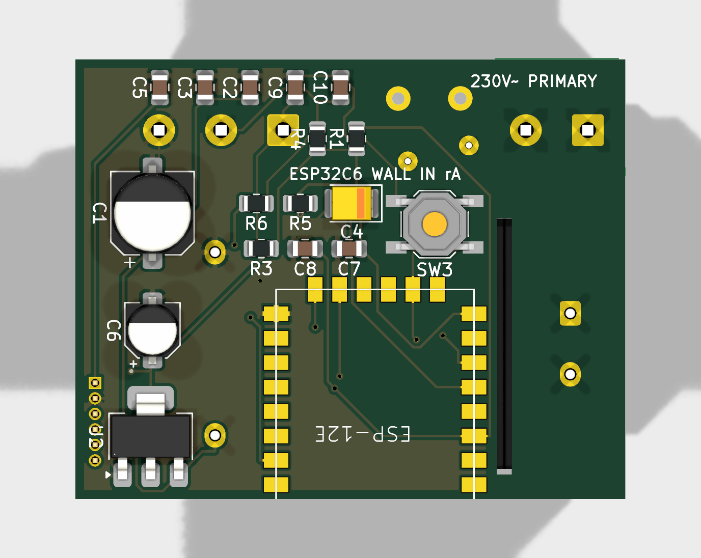
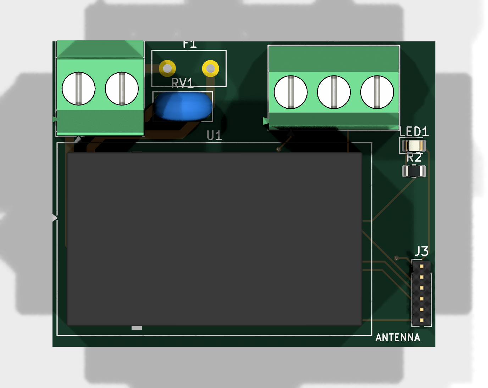
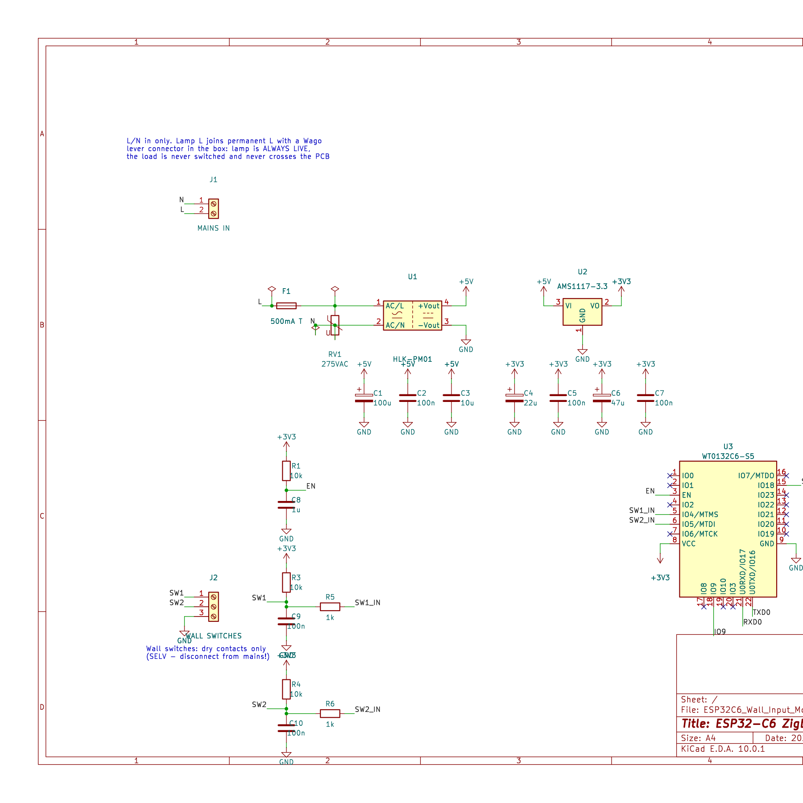

# ESP32-C6 Zigbee In-Wall Input Module

A mains-powered, DIY alternative to the Philips Hue in-wall switch module.

It sits in the wall box behind your existing light switch, keeps the smart
bulbs **permanently powered**, and re-purposes the old mechanical switch as
two low-voltage inputs exposed over Zigbee. Because it runs off mains (not a
coin cell), it joins the mesh as a **Zigbee router**, strengthening the
network instead of being one more sleepy battery device.



## How it works

- A Hi-Link **HLK-PM01** (230 VAC → 5 V) feeds an **AMS1117-3.3**, powering a
  **WT0132C6-S5** (ESP32-C6 in the hand-solderable ESP-12F form factor).
- The lamp's live wire is bridged permanently on (joined with a Wago in the
  box) — the module never switches the load.
- The two existing switch contacts wire to two GPIO inputs (10 kΩ pull-up +
  RC filter each) and are published to Zigbee2MQTT as two contact sensors.
- Automations trigger on **any** change of those contacts, so both rocker
  positions and momentary buttons work to toggle the smart bulbs.

> ⚠️ **230 VAC.** Primary side is fused + MOV-protected and separated from the
> low-voltage side by a milled creepage slot (≥6 mm). The switch wires become
> SELV — disconnect them from mains before landing them. Needs a Neutral in
> the box (or install at the ceiling rose). See [HARDWARE.md](HARDWARE.md).

## Status

| Item | State |
|---|---|
| Schematic | ✅ Complete, ERC-clean (KiCad 10) |
| PCB layout | ✅ Routed, DRC-clean — 45 × 36 mm, 2-layer |
| Firmware | ✅ Arduino sketch (WT0132C6-S5 + XIAO prototype build) |
| Z2M converter | ✅ External converter included |
| Fabrication | 📦 Gerbers exported — **ordered from JLCPCB** |

## Repository contents

| Path | What |
|---|---|
| [`ESP32C6_ZIGBEE_Wall_Input_Module.ino`](ESP32C6_ZIGBEE_Wall_Input_Module.ino) | Arduino sketch (compile-time board switch: WT0132C6-S5 or XIAO ESP32C6 prototype) |
| [`HARDWARE.md`](HARDWARE.md) | Circuit design, net-by-net description, BOM, install guide |
| [`ASSEMBLY.md`](ASSEMBLY.md) | Hand-assembly guide: part IDs/markings, build order, staged bring-up tests |
| [`FABRICATION.md`](FABRICATION.md) | JLCPCB order settings + gerber package |
| [`diy_esp32c6_2ch_input.js`](diy_esp32c6_2ch_input.js) | Zigbee2MQTT external converter (two contact endpoints) |
| [`circuit/`](circuit/) | KiCad 10 project — schematic, board, custom WT0132C6-S5 library, gerbers (`fab/`) |
| [`docs/`](docs/) | Rendered board + schematic images |

## Board

| Top (mains side) | Bottom (logic side) |
|---|---|
|  |  |

The HLK-PM01 and screw terminals are on top; the WT0132C6-S5 is on the bottom
with its antenna overhanging the board edge. The notch in the ground pour and
the milled slot keep the 230 V primary isolated from the SELV side.

## Firmware build

Arduino IDE with the ESP32 core (Zigbee ZCZR mode + partition). Pick the board
at the top of the sketch:

```c
//#define BOARD_XIAO_ESP32C6    // breadboard prototype
#define BOARD_WT0132C6_S5       // final mains board
```

Flash over UART (hold IO9 low, pulse EN). Hold the BOOT button 5 s to factory
reset / re-pair. Status LED blinks while joining, solid when connected.

## Schematic


