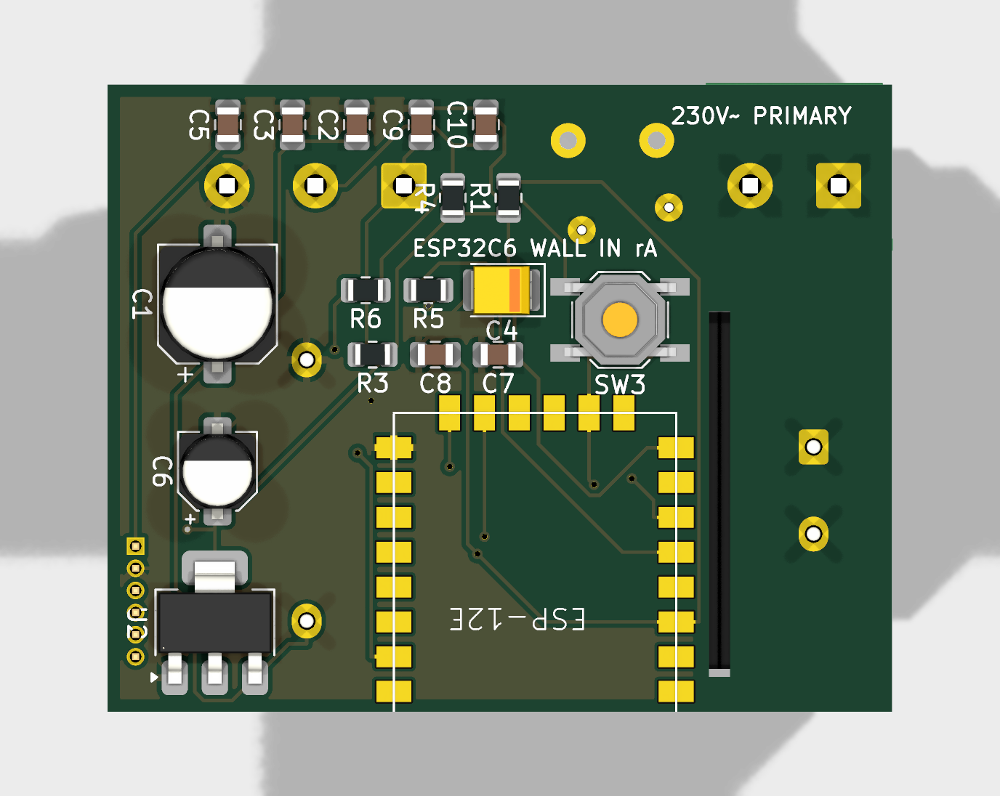
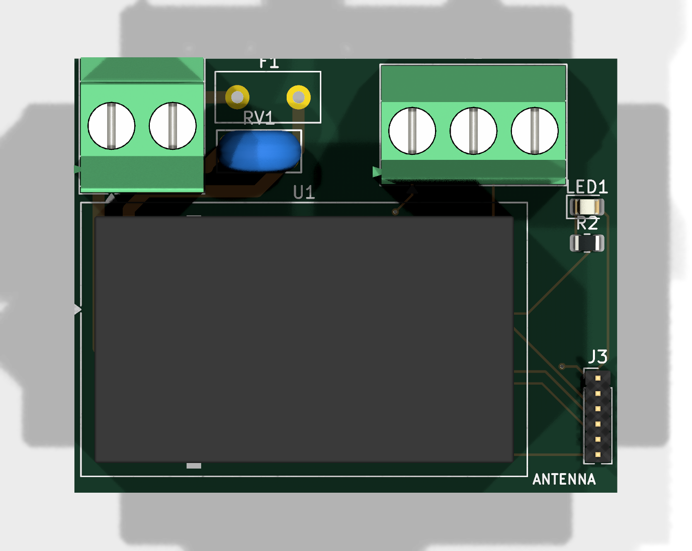
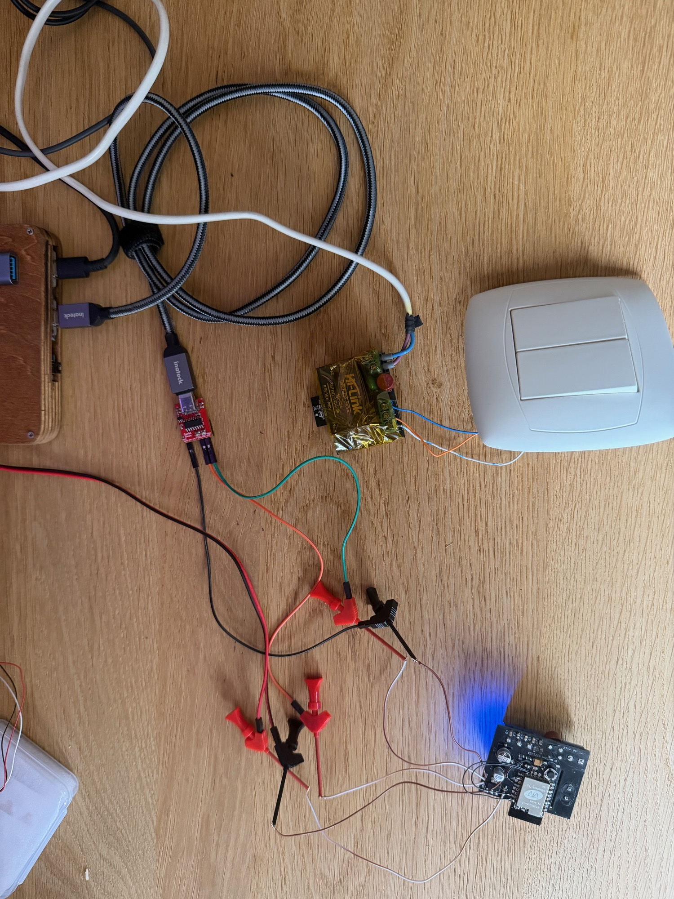
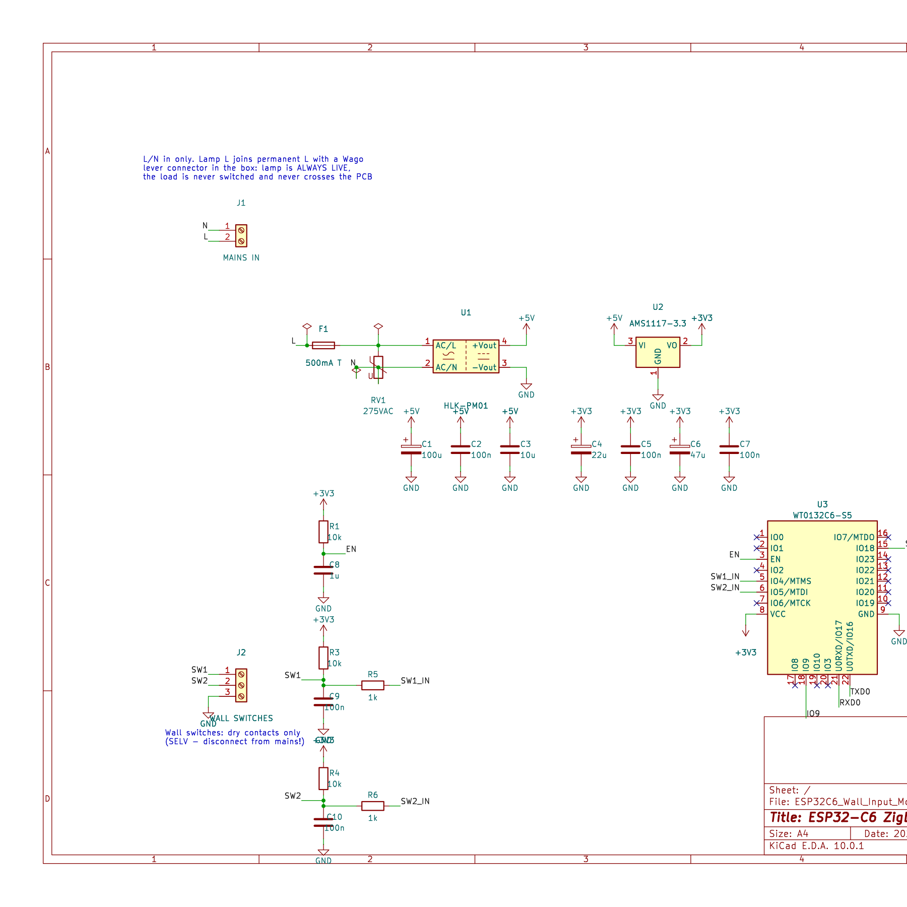

# ESP32-C6 Zigbee In-Wall Input Module

A mains-powered, DIY alternative to the Philips Hue in-wall switch module.

It sits in the wall box behind your existing light switch, keeps the smart
bulbs **permanently powered**, and re-purposes the old mechanical switch as
two low-voltage inputs exposed over Zigbee. Because it runs off mains (not a
coin cell), it joins the mesh as a **Zigbee router**, strengthening the
network instead of being one more sleepy battery device.



## How it works

- A Hi-Link **HLK-PM01** (230 VAC → 5 V) feeds an **AMS1117-3.3**, powering a
  **WT0132C6-S5** (ESP32-C6 in the hand-solderable ESP-12F form factor).
- The lamp's live wire is bridged permanently on (joined with a Wago in the
  box) — the module never switches the load.
- The two existing switch contacts wire to two GPIO inputs (10 kΩ pull-up +
  RC filter each) and are published to Zigbee2MQTT as a **scene switch** —
  button *actions* (single / double / long, plus toggle/on/off), the same
  model as a Hue dimmer or a Modomus switch. HomeKit sees a **Stateless
  Programmable Switch**, not a door sensor.
- Each input's behaviour is **configurable from the Z2M profile** (see
  *Firmware behaviour* below), so the module works with a momentary push
  button *or* a bi-stable (rocker) toggle switch.

> ⚠️ **230 VAC.** Primary side is fused + MOV-protected and separated from the
> low-voltage side by a milled creepage slot (≥6 mm). The switch wires become
> SELV — disconnect them from mains before landing them. Needs a Neutral in
> the box (or install at the ceiling rose). See [HARDWARE.md](HARDWARE.md).

## Firmware behaviour

Each channel is a `genMultistateInput` endpoint reporting an **action**; a
`genMultistateOutput` on the same endpoint holds that channel's **mode**,
writable live from the Z2M UI and persisted in NVS.

| `mode_1` / `mode_2` | Emits | For |
|---|---|---|
| `momentary` *(default)* | `single` / `double` / `hold` | push buttons |
| `toggle` | `toggle` on every flip | rocker → HA does `light.toggle` |
| `toggle_directional` | `on` (closed) / `off` (open) | sync lamp to switch position |
| `toggle_scenes` | `single` / `double` from flip-count | multi-flip scenes off a rocker |

Actions arrive as `button_{1,2}_{single,double,hold,toggle,on,off}`.

**Diagnostics** (Z2M, diagnostic category):
- `device_temperature` — MCU die temp (health/overheat trend, not accurate
  ambient). **Polled** by the converter (a read every ~5 min), not reported:
  every Zigbee attribute-*report* path crashes this ESP-Zigbee build, so the
  firmware only refreshes the value and Z2M reads it. See the sketch header.
- `brownout_count` — increments on a brownout/unexpected reset, so a unit
  browning out in a wall reveals itself remotely with no serial cable.

**Zigbee OTA** — the module carries an OTA client, so after the first (wired)
flash every future update is wireless via Z2M's OTA override index, and images
are **rollback-guarded** (a bad boot reverts automatically). See
[ota/README.md](ota/README.md) for the full build → deploy → update process.

## Status

| Item | State |
|---|---|
| Schematic | ✅ Complete, ERC-clean (KiCad 10); WT0132C6-S5 symbol pinout corrected |
| PCB layout | ✅ Routed, DRC-clean — 45 × 36 mm, 2-layer (status LED on IO7 / pin 10) |
| Firmware | ✅ v8 (`0x01000007`) — scene-switch actions, per-channel modes, rollback-guarded OTA, polled temp + brownout telemetry |
| Z2M converter | ✅ External converter (actions + mode enums + diagnostics; temp polled) |
| Fabrication | 📦 Gerbers exported; **both boards hand-built, on mains, on v8, validated (buttons + modes + temp + brownout), ready to install** |
| OTA proven | ✅ Board 1 updated in-wall v3→v8 over the mesh (rollback-guarded) |

> **Regulator note:** use a *genuine* AMS1117-3.3. A counterfeit part that
> can't source the radio-TX surge causes brownouts on join (cool reg, low LQI,
> won't stay paired). Confirmed by bench-3.3 V bypass; fixed by a real part.
> See [HARDWARE.md](HARDWARE.md).

## Repository contents

| Path | What |
|---|---|
| [`ESP32C6_ZIGBEE_Wall_Input_Module.ino`](ESP32C6_ZIGBEE_Wall_Input_Module.ino) | Arduino sketch (compile-time board switch: WT0132C6-S5 or XIAO ESP32C6 prototype) |
| [`HARDWARE.md`](HARDWARE.md) | Circuit design, net-by-net description, BOM, install guide |
| [`ASSEMBLY.md`](ASSEMBLY.md) | Hand-assembly guide: part IDs/markings, build order, staged bring-up tests |
| [`FABRICATION.md`](FABRICATION.md) | JLCPCB order settings + gerber package |
| [`diy_esp32c6_2ch_input.js`](diy_esp32c6_2ch_input.js) | Zigbee2MQTT external converter (actions, per-channel mode enums, temp + brownout diagnostics, OTA) |
| [`ota/`](ota/) | Zigbee OTA: `make_ota.py` image builder, current `index.json` + `.ota` (mirrors the Pi's `ota_override/`), and [`ota/README.md`](ota/README.md) — the full update process |
| [`circuit/`](circuit/) | KiCad 10 project — schematic, board, custom WT0132C6-S5 library, gerbers (`fab/`) |
| [`docs/`](docs/) | Rendered board + schematic images |

## Board

| Top (mains side) | Bottom (logic side) |
|---|---|
|  |  |

The HLK-PM01 and screw terminals are on top; the WT0132C6-S5 is on the bottom
with its antenna overhanging the board edge. The notch in the ground pour and
the milled slot keep the 230 V primary isolated from the SELV side.

## Prototype / bring-up bench



The bring-up rig: WT0132C6-S5 board (blue status LED lit) fed from the
HLK-PM01, a USB-UART for the first flash, test-clip leads to the two inputs,
and a real dual **rocker** wall switch on the bench — the setup used to
validate the toggle-switch modes and the genuine-AMS1117 fix.

## Firmware build

Arduino IDE with the ESP32 core (Zigbee ZCZR mode + partition). Pick the board
at the top of the sketch:

```c
//#define BOARD_XIAO_ESP32C6    // breadboard prototype
#define BOARD_WT0132C6_S5       // final mains board
```

First flash is over UART (hold IO9 low, pulse EN); **after that, update over
the air** via Z2M OTA — no wires. Hold the BOOT button 5 s to factory reset /
re-pair. Status LED (IO7, active-low) blinks while joining, solid ~3 s when
connected, then off (it lives in a wall).

## Schematic


